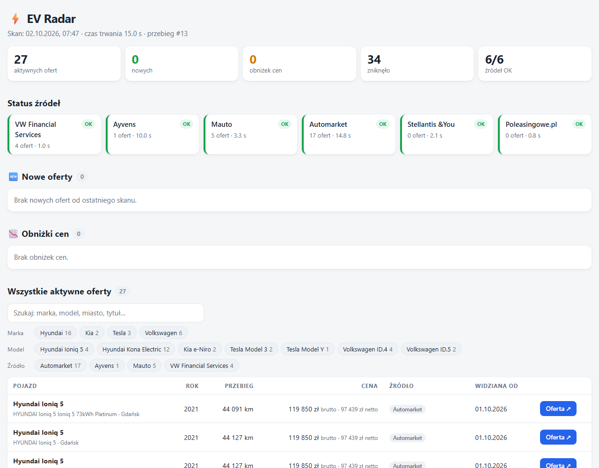
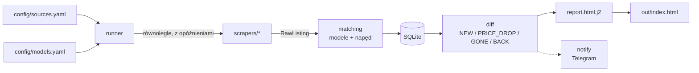

<div align="center">

# ⚡ EV Radar

**Agregator ofert leasingowych i poleasingowych aut elektrycznych z polskich serwisów — w jednym, samodzielnym raporcie HTML.**

[](https://github.com/SigPath/EVRadar/actions/workflows/ci.yml)


[**Raport na żywo →**](https://sigpath.github.io/EVRadar/)



</div>

## Co robi

EV Radar codziennie odpytuje **7 polskich serwisów** z autami leasingowymi/poleasingowymi i ogłoszeniami (w tym Otomoto), wyłuskuje wyłącznie **wybrane modele elektryczne** i porównuje wynik z poprzednim skanem. Efektem jest jeden plik `index.html` (bez serwera i zależności), który otwierasz dwuklikiem albo publikujesz na GitHub Pages.

- 🆕 **Nowe oferty**, 📉 **obniżki cen**, ↩️ **wróciły**, ❌ **zniknęły** — od ostatniego skanu,
- ⚠️ **Do weryfikacji** — oferty, przy których nie da się jednoznacznie stwierdzić, że to auto elektryczne (np. Kia Niro bez podanego paliwa); nic nie jest po cichu odrzucane,
- tabela wszystkich ofert z wyszukiwarką, filtrami (marka, model, źródło) i sortowaniem,
- sekcja **Alternatywnie** — gotowe linki do wyszukiwań na OLX (nie jest skanowany), z filtrem „elektryczne” i limitem ceny,
- status każdego źródła (`OK` / `BŁĄD` / `POMINIĘTE` / `DO AKTUALIZACJI`),
- ceny **brutto i netto** obok siebie (gdy serwis podaje tylko jedną, druga jest wyliczana przez VAT 23%),
- opcjonalne powiadomienia Telegram, gdy pojawią się nowe oferty.

**Śledzone modele** (konfigurowalne w [`config/models.yaml`](config/models.yaml)): Kia e-Niro / Niro EV / EV4, Hyundai Kona Electric / Ioniq 5, Tesla Model 3 / Model Y, Volkswagen ID.4 / ID.5.

## Źródła danych

| Źródło | Skąd dane | Ceny w serwisie |
|---|---|---|
| **VW Financial Services Store** (`vwfs`) | JSON z `__NEXT_DATA__` | brutto + netto |
| **Ayvens** (`ayvens`) | HTML SSR + JSON w kafelkach | brutto |
| **mAuto** (`mauto`) | publiczne API JSON | brutto + netto |
| **Automarket / PKO Leasing** (`automarket`) | `__NUXT_DATA__` | netto (oferty dla firm) lub brutto |
| **Stellantis &You** (`stellantis`) | publiczny indeks Algolia używany przez stronę | brutto |
| **Poleasingowe.pl** (`poleasingowe`) | HTML (aukcje) | netto |
| **Otomoto** (`otomoto`) | SSR: `__NEXT_DATA__` → `advertSearch` (per model, paginacja) | brutto lub netto (flaga `isGross`) |

**Nieskanowane:** OLX zwraca 403 już na `robots.txt`, a Allegro blokuje boty (403 na kategoriach) — traktujemy to jak zakaz i niczego nie omijamy. OLX mamy jako linki w sekcji **Alternatywnie**; część ogłoszeń z OLX jest i tak widoczna na Otomoto.

Gdzie się da, używamy publicznych API JSON zamiast parsowania HTML. Źródła, których nie da się pobrać zgodnie z `robots.txt` i bez omijania zabezpieczeń, są wyłączane w [`config/sources.yaml`](config/sources.yaml) (`enabled: false` z podaniem powodu).

### Ceny

Cena jest zapisywana tak, jak podaje ją serwis (brutto lub netto). Gdy serwis podaje tylko jedną z nich, druga jest wyliczana przez VAT 23% (netto → brutto lub brutto → netto). Raport pokazuje „brutto” i „netto” przy kwocie. Rata leasingowa przechowuje własną informację o podstawie (netto/brutto).

## Jak to działa



Awaria jednego źródła nie przerywa skanu — oferty takiego źródła **nie są** wtedy oznaczane jako „zniknęły”.

## Szybki start (Windows)

Wymagania: Python 3.12+ i [uv](https://docs.astral.sh/uv/).

```powershell
winget install astral-sh.uv        # jednorazowo; potem otwórz terminal ponownie
cd C:\Dev\EVLeaseSentinel
uv sync
uv run evradar run
```

Po kilkunastu sekundach w terminalu pojawi się tabela z wynikami, a raport otworzy się w przeglądarce. Raport leży w `out\index.html`, baza ofert w `data\evradar.db`. Zamiast komend możesz dwukliknąć [`run_daily.bat`](run_daily.bat).

### Polecenia CLI

| Polecenie | Co robi |
|---|---|
| `uv run evradar run` | skan wszystkich źródeł + raport |
| `uv run evradar run --source mauto,ayvens` | tylko wybrane źródła |
| `uv run evradar run --dry-run` | skan bez zapisu do bazy |
| `uv run evradar run --no-open` | bez otwierania przeglądarki |
| `uv run evradar report --last` | przegenerowanie raportu z bazy, bez skanowania |
| `uv run evradar sources` | lista źródeł i status ostatniego skanu |
| `uv run evradar demo-report` | raport na danych syntetycznych (podgląd wyglądu) |

## Konfiguracja

**[`config/models.yaml`](config/models.yaml)** — modele, aliasy nazw i filtry:

```yaml
targets:
  kia:
    - { model: "Niro", aliases: ["Niro"], require_electric: true }   # odfiltruj HEV/PHEV
  volkswagen:
    - { model: "ID.4", aliases: ["ID4", "ID 4", "ID.4 GTX"] }
brand_aliases:
  volkswagen: ["VW"]
filters:
  max_price_gross_pln: 130000   # null = bez limitu
  max_mileage_km: null
  min_year: null
notifications:
  enabled: false
```

- Dopasowanie nazw ignoruje wielkość liter, spacje, myślniki i polskie znaki (`IONIQ5` = `Ioniq 5`); nigdy nie myli różnych cyfr (`Ioniq 6` ≠ `Ioniq 5`).
- `require_electric: true` — dla modeli występujących także jako hybryda/spalinowe (Niro, Kona). Przy niejednoznacznych danych oferta trafia do **Do weryfikacji**.
- Filtr ceny działa na cenie brutto; oferty bez ceny nie są odrzucane.

**[`config/sources.yaml`](config/sources.yaml)** — adresy, opóźnienia (`delay_min_s` / `delay_max_s`), `max_pages`, `enabled: true/false` (z `reason`).

Sekcja `alternatives` w `models.yaml` opisuje linki z sekcji **Alternatywnie** w raporcie: szablony adresów portali (`sites`) i wyszukiwania per model (`searches`, np. `{ label: "Volkswagen ID.4", olx: "volkswagen/q-id4" }`). Limit ceny jest dołączany z `filters.max_price_gross_pln`. Ścieżki modeli dla Otomoto (`params.paths`) są w `sources.yaml`.

## Publikacja raportu (GitHub Pages)

Raport z działającej strony budowany jest **lokalnie** i wypychany na gałąź `gh-pages`:

```powershell
.\publish_report.ps1 -Scan      # skan + publikacja
.\publish_report.ps1            # publikacja ostatnio wygenerowanego raportu
```

Ustawienie jednorazowe: *Settings → Pages → Source: Deploy from a branch → `gh-pages` / root*.

**Dlaczego lokalnie, a nie w GitHub Actions?** Część serwisów (np. VWFS) odrzuca adresy IP centrów danych HTTP 403 już na `robots.txt`. Projekt traktuje to jak zakaz i niczego nie obchodzi — dlatego skan ze zwykłego łącza domowego widzi pełny komplet źródeł.

**Codzienna automatyzacja (Harmonogram zadań Windows):**

```powershell
$action  = New-ScheduledTaskAction -Execute "powershell.exe" -WorkingDirectory "C:\Dev\EVLeaseSentinel" `
           -Argument '-NoProfile -ExecutionPolicy Bypass -File "C:\Dev\EVLeaseSentinel\publish_report.ps1" -Scan'
$trigger = New-ScheduledTaskTrigger -Daily -At 12:00
Register-ScheduledTask -TaskName "EVRadar Daily Report" -Action $action -Trigger $trigger `
           -Settings (New-ScheduledTaskSettingsSet -StartWhenAvailable)
```

Workflow [`daily.yml`](.github/workflows/daily.yml) to opcjonalny, ręcznie uruchamiany skan na GitHub Actions (raport tylko jako artefakt, bez publikacji na Pages); skan z serwerów GitHuba pomija źródła blokujące adresy IP centrów danych. [`ci.yml`](.github/workflows/ci.yml) uruchamia lint, typy i testy przy każdym pushu.

**Powiadomienia (opcjonalne):** w `config/models.yaml` ustaw `notifications.enabled: true`, a w środowisku `TELEGRAM_BOT_TOKEN` i `TELEGRAM_CHAT_ID`. Wiadomość wychodzi tylko wtedy, gdy są nowe oferty.

## Jak dodać nowe źródło

1. W `config/sources.yaml` dodaj wpis (klucz = `source_id`, np. `mojserwis`).
2. **Najpierw zbadaj stronę**: sprawdź `robots.txt`, a w przeglądarce (F12 → Network → Fetch/XHR) poszukaj publicznego API JSON (`/api/`, `_next/data`, `__NEXT_DATA__`, `__NUXT_DATA__`, GraphQL, Algolia). HTML to ostateczność. Znajdź parametry filtrujące auta elektryczne i marki.
3. Zapisz realną odpowiedź do `tests/fixtures/mojserwis/` — **selektorów nie wymyślamy**.
4. Utwórz `src/evradar/scrapers/mojserwis.py` z klasą `MojserwisScraper(BaseScraper)`: czysta funkcja `parse…()` (HTML/JSON → `RawListing`, bez sieci) i `fetch()` korzystające z `get_text` / `get_json` / `post_json` (robots.txt, opóźnienia i retry są wbudowane). W docstringu modułu opisz źródło danych, parametry URL i podstawę cen (netto/brutto). Adapter wykrywany jest automatycznie po nazwie pliku.
5. Napisz `tests/test_mojserwis.py` (offline, ≥ 3 oferty). Wzór: [`vwfs.py`](src/evradar/scrapers/vwfs.py) i [`test_vwfs.py`](tests/test_vwfs.py).
6. Sprawdź na żywo: `uv run evradar run --source mojserwis --dry-run --no-open`.

W VS Code z Copilotem możesz użyć promptu `/add-source` ([`.github/prompts/add-source.prompt.md`](.github/prompts/add-source.prompt.md)).

## Gdy strona zmieni wygląd

Objaw: kafelek źródła ma status **DO AKTUALIZACJI** (parser zwrócił 0 ogłoszeń, a wcześniej zwracał >0) albo **BŁĄD**.

1. Obejrzyj ostatnią pobraną treść w `debug\<źródło>-<data>.html`.
2. Porównaj ze starą w `tests\fixtures\<źródło>\`, podmień fixture i popraw `parse…()`.
3. `uv run pytest tests/test_<źródło>.py`, a potem `uv run evradar run --source <źródło> --dry-run`.

Typowe przyczyny: zmiana nazwy parametru filtra, nowy format JSON, rotacja klucza API (Stellantis: odśwież `algolia_api_key` z `pl.sandy-const.json`), nowy `buildId` Next.js.

## Zasady scrapowania

- respektujemy `robots.txt` (wraz z regułami z `*` i `$`); odpowiedź 401/403 traktujemy jak zakaz,
- opóźnienie 1–3 s między żądaniami, maks. 2 równoległe żądania na źródło, retry z backoffem (3 próby), timeout 30 s,
- bez omijania CAPTCHA i zabezpieczeń antybotowych, bez logowania na konta,
- awaria jednego źródła nie przerywa skanu.

Projekt służy do osobistego przeglądu publicznie dostępnych ofert. Dane należą do ich właścicieli — przed jakimkolwiek innym użyciem sprawdź regulaminy serwisów.

## Rozwój

```powershell
uv run pytest         # testy offline (fixture'y w tests\fixtures\)
uv run ruff check .   # lint
uv run mypy           # typy (strict)
```

```text
src/evradar/
├── cli.py            # polecenia: run | report | sources | demo-report
├── runner.py         # orkiestracja skanu, wykrywanie zmian struktury stron
├── scrapers/         # po jednym adapterze na źródło (wykrywane automatycznie)
├── matching.py       # normalizacja nazw, dopasowanie modeli, is_electric()
├── parsing.py        # ceny, VAT 23% (netto ⇄ brutto)
├── storage.py        # SQLite (oferty, historia cen, przebiegi skanów)
├── diff.py           # NEW / PRICE_DROP / PRICE_UP / GONE / BACK
├── report.py         # + templates/report.html.j2 — samodzielny raport HTML
├── robots.py         # respektowanie robots.txt
└── notify.py         # powiadomienia Telegram
```

Stack: Python 3.12, `httpx` + `selectolax`, `pydantic` v2, `sqlite3`, `jinja2`, `typer` + `rich`, `structlog`, `pytest`, `ruff`, `mypy --strict`. Playwright jest w zależnościach na wypadek stron wymagających przeglądarki (obecnie żaden adapter go nie potrzebuje).
