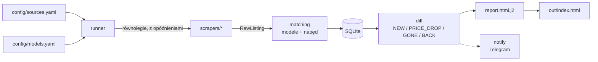

<div align="center">

# ⚡ EV Radar

**Agregator ofert leasingowych i poleasingowych aut elektrycznych z polskich serwisów — w jednym, samodzielnym raporcie HTML.**

[](https://github.com/SigPath/EVRadar/actions/workflows/ci.yml)


[**Raport na żywo →**](https://sigpath.github.io/EVRadar/)


</div>

## Co robi

EV Radar codziennie odpytuje **9 polskich serwisów** z autami leasingowymi/poleasingowymi i ogłoszeniami (w tym Otomoto, Autoplac, FindCar), wyłuskuje wyłącznie **wybrane modele elektryczne** i porównuje wynik z poprzednim skanem. Efektem jest jeden plik `index.html` (bez serwera i zależności), który otwierasz dwuklikiem albo publikujesz na GitHub Pages.

- 🆕 **Nowe oferty**, 📉 **obniżki cen**, ↩️ **wróciły**, ❌ **zniknęły** — od ostatniego skanu,
- ⚠️ **Do weryfikacji** — oferty, przy których nie da się jednoznacznie stwierdzić, że to auto elektryczne (np. Kia Niro bez podanego paliwa); nic nie jest po cichu odrzucane,
- tabela wszystkich ofert z miniaturami, wyszukiwarką, filtrami (marka, model, źródło) i sortowaniem; przy cenie **mini wykres** (zielony = spadła, czerwony = wzrosła), gdy oferta zmieniła cenę (historia zapełnia się z każdym skanem),
- kolumna **Vs rynek**: cena brutto względem mediany porównywalnych ofert (ten sam model i rocznik, przy małej próbie sam model; min. 4–5 ofert); sortowanie rosnące pokazuje największe okazje,
- przyciski **★ obserwuj** i **✕ ukryj** przy ofercie (zapamiętywane w przeglądarce, `localStorage`) oraz filtry „Tylko obserwowane” i „Pokaż ukryte”; odwiedzone linki „Oferta” szarzeją,
- sekcja **Alternatywnie** — gotowe linki do wyszukiwań na OLX (nie jest skanowany), z filtrem „elektryczne” i limitem ceny,
- status każdego źródła (`OK` / `BŁĄD` / `POMINIĘTE` / `DO AKTUALIZACJI`),
- ceny **brutto i netto** obok siebie (gdy serwis podaje tylko jedną, druga jest wyliczana przez VAT 23%),
- opcjonalne powiadomienia Telegram: o nowych ofertach oraz o awarii źródła,
- **baner awarii** na górze raportu, gdy źródło zwróciło błąd lub 0 ofert, oraz ostrzeżenie, gdy raport jest starszy niż 36 h (zadanie dzienne nie działa),
- **suwaki** ceny, przebiegu i rocznika nad tabelą (filtrowanie w przeglądarce, bez edycji YAML i ponownego skanu),
- sekcja **Trend cen modeli**: mediana ceny brutto modelu w kolejnych dniach skanu (zapisywana od pierwszego skanu po wdrożeniu),
- sekcja **Deprecjacja modeli**: mediany cen po rocznikach, wykres cena vs przebieg (kolor = rocznik) i szacowany spadek ceny za rok wieku oraz za 10 tys. km (regresja, min. 8 ofert modelu; współczynniki o nielogicznym znaku są pomijane),
- kolumna **W ofercie** (dni od daty dodania ogłoszenia, a gdy jej brak — od pierwszego skanu, z „+”) i sekcja **Czas ekspozycji**: mediana wieku aktywnych ofert oraz czas do zniknięcia ofert, których już nie ma w źródłach,
- **zasięg WLTP** przy ofercie: z ogłoszenia lub z tabeli `range_wltp` w `config/models.yaml`,
- **to samo auto z kilku źródeł** jest grupowane po numerze VIN (gdy źródło go podaje), a przy odnośniku do drugiego serwisu widać jego cenę,
- **zdrowie źródeł**: słupki liczby ofert z ostatnich przebiegów w kafelku źródła i ostrzeżenie przy nagłym spadku (poniżej połowy zwykłej liczby),
- z Otomoto: typ sprzedawcy (firma/prywatna, też jako filtr), data dodania ogłoszenia i SOH baterii wyciągany z opisu,
- oferty **nowe, obniżki, powroty i podwyżki** wyglądają tak samo jak główna tabela (te same kolumny, sortowanie, ★ ✕),
- z Otomoto są wycinane oferty oznaczone „Uszkodzony: Tak” (wyłączenie: `exclude_damaged: false` w `config/sources.yaml`).

**Śledzone modele** (konfigurowalne w [`config/models.yaml`](config/models.yaml)): Kia e-Niro / Niro EV / EV3 / EV4 / EV6, Hyundai Kona Electric / Ioniq 5, Tesla Model 3 / Model Y, Volkswagen ID.3 / ID.4 / ID.5, Skoda Enyaq.

## Źródła danych

| Źródło | Skąd dane | Ceny w serwisie |
|---|---|---|
| **VW Financial Services Store** (`vwfs`) | JSON z `__NEXT_DATA__` | brutto + netto |
| **Ayvens** (`ayvens`) | HTML SSR + JSON w kafelkach | brutto |
| **mAuto** (`mauto`) | publiczne API JSON | brutto + netto |
| **Automarket / PKO Leasing** (`automarket`) | `__NUXT_DATA__` | netto (oferty dla firm) lub brutto |
| **Stellantis &You** (`stellantis`) | publiczny indeks Algolia używany przez stronę | brutto |
| **Poleasingowe.pl** (`poleasingowe`) | HTML (aukcje) | netto |
| **Otomoto** (`otomoto`) | SSR: `__NEXT_DATA__` → `advertSearch` (per model, paginacja; bez ofert „Uszkodzony: Tak”) | brutto lub netto (flaga `isGross`) |
| **Autoplac** (`autoplac`) | SSR Angular: `ng-state` → lista ofert (per model, `?p=N`) | brutto + netto (gdy FV) |
| **FindCar** (`findcar`) | SSR Angular: `ng-state` → TanStack Query (per marka, `/znajdz-samochod/N`) | brutto |

**Nieskanowane:** OLX zwraca 403 już na `robots.txt`, a Allegro blokuje boty (403 na kategoriach) — traktujemy to jak zakaz i niczego nie omijamy. OLX mamy jako linki w sekcji **Alternatywnie**; część ogłoszeń z OLX jest i tak widoczna na Otomoto.

Gdzie się da, używamy publicznych API JSON zamiast parsowania HTML. Źródła, których nie da się pobrać zgodnie z `robots.txt` i bez omijania zabezpieczeń, są wyłączane w [`config/sources.yaml`](config/sources.yaml) (`enabled: false` z podaniem powodu).

### Ceny

Cena jest zapisywana tak, jak podaje ją serwis (brutto lub netto). Gdy serwis podaje tylko jedną z nich, druga jest wyliczana przez VAT 23% (netto → brutto lub brutto → netto). Raport pokazuje „brutto” i „netto” przy kwocie. Rata leasingowa przechowuje własną informację o podstawie (netto/brutto).

## Jak to działa



Awaria jednego źródła nie przerywa skanu — oferty takiego źródła **nie są** wtedy oznaczane jako „zniknęły”.

## Szybki start

Wymagania: Python 3.12+ i [uv](https://docs.astral.sh/uv/). Działa na **Windows i macOS** —
kod jest identyczny, różnią się tylko skrypty uruchomieniowe.

### macOS

macOS ma domyślnie Python 3.9, a projekt wymaga 3.12+ (używa `StrEnum` i `datetime.UTC`
z Pythona 3.11). Nie musisz instalować Pythona ręcznie — `uv` zrobi to sam.

```bash
# jednorazowo: uv (jeśli nie masz)
curl -LsSf https://astral.sh/uv/install.sh | sh
# potem otwórz nowy terminal, żeby uv trafił do PATH

cd ~/Desktop/EVRadar
uv sync                 # pobierze też Pythona 3.12
uv run evradar run
```

Raport leży w `out/index.html`, baza ofert w `data/evradar.db`. Zamiast komend:

```bash
./run_daily.sh                  # skan wszystkich źródeł
./run_daily.sh --source mauto   # tylko wybrane źródła
```

Jeśli skrypty zgubią uprawnienia wykonywania (np. po sklonowaniu repo na innym komputerze):

```bash
chmod +x run_daily.sh publish_report.sh install_schedule.sh
```

### Windows

```powershell
winget install astral-sh.uv        # jednorazowo; potem otwórz terminal ponownie
cd C:\Dev\EVLeaseSentinel
uv sync
uv run evradar run
```

Po kilkunastu sekundach w terminalu pojawi się tabela z wynikami, a raport otworzy się w przeglądarce. Raport leży w `out\index.html`, baza ofert w `data\evradar.db`. Zamiast komend możesz dwukliknąć [`run_daily.bat`](run_daily.bat).

### Polecenia CLI

| Polecenie | Co robi |
|---|---|
| `uv run evradar run` | skan wszystkich źródeł + raport |
| `uv run evradar run --source mauto,ayvens` | tylko wybrane źródła |
| `uv run evradar run --dry-run` | skan bez zapisu do bazy |
| `uv run evradar run --open` | otwiera raport w przeglądarce po skanie (domyślnie nie otwiera) |
| `uv run evradar report --last` | przegenerowanie raportu z bazy, bez skanowania |
| `uv run evradar sources` | lista źródeł i status ostatniego skanu |
| `uv run evradar health` | zdrowie źródeł: liczba ofert z ostatnich przebiegów i wykryte spadki |
| `uv run evradar backup` | kopia bazy w `data/backups` (po każdym skanie robiona automatycznie, zostaje 14 ostatnich dni) |
| `uv run evradar demo-report` | raport na danych syntetycznych (podgląd wyglądu) |

## Konfiguracja

**[`config/models.yaml`](config/models.yaml)** — modele, aliasy nazw i filtry:

```yaml
targets:
  kia:
    - { model: "Niro", aliases: ["Niro"], require_electric: true }   # odfiltruj HEV/PHEV
  volkswagen:
    - { model: "ID.4", aliases: ["ID4", "ID 4", "ID.4 GTX"] }
brand_aliases:
  volkswagen: ["VW"]
filters:
  max_price_gross_pln: 130000   # null = bez limitu
  min_price_gross_pln: null     # opcjonalny dolny próg ceny
  max_mileage_km: 122000
  min_year: 2021
  exclude_text_patterns:        # regexy na tytuł + opis (bez polskich znaków)
    - 'cesj'
    - 'przejec\w*\s+(umowy\s+)?leasing'
notifications:
  enabled: false
range_wltp:                     # zasięg WLTP, gdy ogłoszenie go nie podaje (pierwsza pasująca reguła)
  - { brand: Hyundai, model: "Kona Electric", kwh: 64, km: 484, year_to: 2022 }
```

- Dopasowanie nazw ignoruje wielkość liter, spacje, myślniki i polskie znaki (`ID3` = `ID.3`); nigdy nie myli różnych cyfr (`ID.3` ≠ `ID.4`).
- `require_electric: true` — dla modeli występujących także jako hybryda/spalinowe (Niro, Kona). Przy niejednoznacznych danych oferta trafia do **Do weryfikacji**.
- Filtry ceny działają na cenie brutto, a filtr przebiegu na `max_mileage_km`. Oferty bez ceny, przebiegu lub rocznika nie są odrzucane.
- `exclude_text_patterns` odrzuca ogłoszenia po treści (tytuł i, gdy serwis go podaje, opis): domyślnie „cesja”, „przejęcie leasingu” i „rata <kwota>”. Dzięki temu tanie, normalne auta nie odpadają przez dolny próg ceny. Opis w skanie jest dostępny z Otomoto; pozostałe źródła dają tylko tytuł.
- `range_wltp` uzupełnia zasięg WLTP dla ofert, które go nie podają. Reguła ma `brand`, `model`, `km` oraz opcjonalnie `kwh` (±0,5 kWh), `year_from` / `year_to` i `title` (regex); warunek, którego nie da się sprawdzić (np. brak kWh w ogłoszeniu), oznacza brak dopasowania — nic nie jest zgadywane. Wartości w pliku są orientacyjne, zweryfikuj je z kartą katalogową.

**[`config/sources.yaml`](config/sources.yaml)** — adresy, opóźnienia (`delay_min_s` / `delay_max_s`), `max_pages`, `enabled: true/false` (z `reason`) oraz `priority` (przy duplikacie oferty zostaje źródło o niższej wartości; Otomoto ma 200).

**Duplikaty:** to samo auto z kilku źródeł trafia do raportu raz, a w kolumnie Źródło widać wszystkie portale z linkami do ogłoszeń (po najechaniu — także ich cenę); filtr Źródło i wyszukiwarka też je uwzględniają. Auta są łączone po **numerze VIN** (podają go Stellantis, Automarket i Ayvens), nawet gdy cena lub przebieg się różnią. Oferty bez VIN łączone są po modelu, roczniku, przebiegu i cenie brutto, ale dwa różne VIN-y nigdy się nie łączą. Dla aut z przebiegiem poniżej 1000 km porównywane jest też miasto, a oferty bez rocznika, przebiegu lub ceny nigdy nie są łączone. Liczbę pominiętych duplikatów widzisz w kafelku źródła.

Sekcja `alternatives` w `models.yaml` opisuje linki z sekcji **Alternatywnie** w raporcie: szablony adresów portali (`sites`) i wyszukiwania per model (`searches`, np. `{ label: "Volkswagen ID.4", olx: "volkswagen/q-id4" }`). Limit ceny jest dołączany z `filters.max_price_gross_pln`. Ścieżki modeli dla Otomoto (`params.paths`) są w `sources.yaml`.

## Publikacja raportu (GitHub Pages)

Raport z działającej strony budowany jest **lokalnie** i wypychany na gałąź `gh-pages`:

```powershell
.\publish_report.ps1 -Scan      # skan + publikacja
.\publish_report.ps1            # publikacja ostatnio wygenerowanego raportu
```

Na macOS to samo robi skrypt w bashu:

```bash
./publish_report.sh --scan      # skan + publikacja
./publish_report.sh             # publikacja ostatnio wygenerowanego raportu
```

Oba skrypty robią dokładnie to samo: klonują `gh-pages` do katalogu tymczasowego, podmieniają
`index.html`, dodają `.nojekyll` i wypychają commit **tylko wtedy, gdy raport faktycznie się
zmienił**. Log z przebiegu trafia do `out/publish.log`.

Ustawienie jednorazowe: *Settings → Pages → Source: Deploy from a branch → `gh-pages` / root*.

**Dlaczego lokalnie, a nie w GitHub Actions?** Część serwisów (np. VWFS) odrzuca adresy IP centrów danych HTTP 403 już na `robots.txt`. Projekt traktuje to jak zakaz i niczego nie obchodzi — dlatego skan ze zwykłego łącza domowego widzi pełny komplet źródeł. Ta sama blokada dotyczy Cloudflare Workers i innych chmur — zmierzone: z adresów Cloudflare `store.vwfs.pl` i `otomoto.pl` zwracają 403, a `poleasingowe.pl` i `automarket.pl` odmawiają połączenia.

### macOS — codzienna automatyzacja (launchd)

```bash
./install_schedule.sh           # codziennie o 12:00
./install_schedule.sh 8 30      # codziennie o 08:30
./install_schedule.sh --status  # stan zadania + ostatnie wpisy z logu
./install_schedule.sh --remove  # usunięcie zadania
```

Skrypt tworzy `~/Library/LaunchAgents/com.evradar.daily.plist` i ładuje go do `launchd`.
Dlaczego `launchd`, a nie `cron`: **cron nie odpala zadań, gdy Mac jest uśpiony** — `launchd`
z `RunAtLoad` wykona zaległy skan po wybudzeniu lub zalogowaniu.

### Windows — codzienna automatyzacja (Harmonogram zadań)

```powershell
$action  = New-ScheduledTaskAction -Execute "powershell.exe" -WorkingDirectory "C:\Dev\EVLeaseSentinel" `
           -Argument '-NoProfile -ExecutionPolicy Bypass -File "C:\Dev\EVLeaseSentinel\publish_report.ps1" -Scan'
$trigger = New-ScheduledTaskTrigger -Daily -At 12:00
Register-ScheduledTask -TaskName "EVRadar Daily Report" -Action $action -Trigger $trigger `
           -Settings (New-ScheduledTaskSettingsSet -StartWhenAvailable)
```

Workflow [`daily.yml`](.github/workflows/daily.yml) to opcjonalny, ręcznie uruchamiany skan na GitHub Actions (raport tylko jako artefakt, bez publikacji na Pages); skan z serwerów GitHuba pomija źródła blokujące adresy IP centrów danych. [`ci.yml`](.github/workflows/ci.yml) uruchamia lint, typy i testy przy każdym pushu.

### Praca na dwóch komputerach — przeczytaj przed pierwszym skanem na Macu

**Baza `data/evradar.db` jest lokalna dla komputera i nie jest w repozytorium.** Skan na
innym komputerze startuje z pustą bazą — a to baza pamięta, które oferty już widziałeś.
Skutki przy pierwszym przebiegu na nowej maszynie:

- **wszystkie oferty pokażą się jako „nowe"** (baza nie zna poprzedniego stanu),
- **żadna nie pokaże się jako „zniknęła"** ani nie dostaniesz obniżek cen — brak historii do porównania,
- w sekcji **Trend cen modeli** i **Czas ekspozycji** nie będzie jeszcze danych (zbierają się od pierwszego skanu),
- jeśli masz włączone powiadomienia Telegram, przyjdzie wiadomość o kilkuset „nowych" ofertach.

Po jednym–dwóch skanach historia się uzupełnia i wszystko wraca do normy. Jeśli nie chcesz
tego jednorazowego zamieszania, **skopiuj bazę** z komputera, który skanował dotąd:

```bash
# z Windows na Maca (albo odwrotnie) — plik ma zwykle kilkaset kB
scp windows-pc:"C:/Dev/EVLeaseSentinel/data/evradar.db" ~/Desktop/EVRadar/data/evradar.db
```

**Zalecenie:** skanuj regularnie z **jednego** komputera, a na drugim używaj
`uv run evradar report --last` do podejrzenia raportu z bazy — wtedy diffy i historia
pozostają spójne. Publikacja na `gh-pages` z obu maszyn jest bezpieczna (raport jest
generowany w całości), ale raport będzie odzwierciedlał stan tej bazy, z której powstał.

**Powiadomienia (opcjonalne):** w `config/models.yaml` ustaw `notifications.enabled: true`, a w środowisku `TELEGRAM_BOT_TOKEN` i `TELEGRAM_CHAT_ID`. Wiadomość o nowych ofertach wychodzi tylko wtedy, gdy są nowe oferty; osobny alert wychodzi, gdy któreś źródło ma status `BŁĄD` lub `DO AKTUALIZACJI` (nie w trybie dry-run).

## Jak dodać nowe źródło

1. W `config/sources.yaml` dodaj wpis (klucz = `source_id`, np. `mojserwis`).
2. **Najpierw zbadaj stronę**: sprawdź `robots.txt`, a w przeglądarce (F12 → Network → Fetch/XHR) poszukaj publicznego API JSON (`/api/`, `_next/data`, `__NEXT_DATA__`, `__NUXT_DATA__`, GraphQL, Algolia). HTML to ostateczność. Znajdź parametry filtrujące auta elektryczne i marki.
3. Zapisz realną odpowiedź do `tests/fixtures/mojserwis/` — **selektorów nie wymyślamy**.
4. Utwórz `src/evradar/scrapers/mojserwis.py` z klasą `MojserwisScraper(BaseScraper)`: czysta funkcja `parse…()` (HTML/JSON → `RawListing`, bez sieci) i `fetch()` korzystające z `get_text` / `get_json` / `post_json` (robots.txt, opóźnienia i retry są wbudowane). W docstringu modułu opisz źródło danych, parametry URL i podstawę cen (netto/brutto). Adapter wykrywany jest automatycznie po nazwie pliku.
5. Napisz `tests/test_mojserwis.py` (offline, ≥ 3 oferty). Wzór: [`vwfs.py`](src/evradar/scrapers/vwfs.py) i [`test_vwfs.py`](tests/test_vwfs.py).
6. Sprawdź na żywo: `uv run evradar run --source mojserwis --dry-run --no-open`.

W VS Code z Copilotem możesz użyć promptu `/add-source` ([`.github/prompts/add-source.prompt.md`](.github/prompts/add-source.prompt.md)).

## Gdy strona zmieni wygląd

Objaw: kafelek źródła ma status **DO AKTUALIZACJI** (parser zwrócił 0 ogłoszeń, a wcześniej zwracał >0) albo **BŁĄD**.

1. Obejrzyj ostatnią pobraną treść w `debug\<źródło>-<data>.html`.
2. Porównaj ze starą w `tests\fixtures\<źródło>\`, podmień fixture i popraw `parse…()`.
3. `uv run pytest tests/test_<źródło>.py`, a potem `uv run evradar run --source <źródło> --dry-run`.

Typowe przyczyny: zmiana nazwy parametru filtra, nowy format JSON, rotacja klucza API (Stellantis: odśwież `algolia_api_key` z `pl.sandy-const.json`), nowy `buildId` Next.js.

## Zasady scrapowania

- respektujemy `robots.txt` (wraz z regułami z `*` i `$`); odpowiedź 401/403 traktujemy jak zakaz,
- opóźnienie 1–3 s między żądaniami, maks. 2 równoległe żądania na źródło, retry z backoffem (3 próby), timeout 30 s,
- bez omijania CAPTCHA i zabezpieczeń antybotowych, bez logowania na konta,
- awaria jednego źródła nie przerywa skanu.

Projekt służy do osobistego przeglądu publicznie dostępnych ofert. Dane należą do ich właścicieli — przed jakimkolwiek innym użyciem sprawdź regulaminy serwisów.

## Rozwój

```bash
uv run pytest         # testy offline (fixture'y w tests/fixtures/) — 171 testów
uv run ruff check .   # lint
uv run mypy           # typy (strict)
```

Te same polecenia działają na Windows i macOS. Pierwsze `uv sync` na macOS pobiera
Pythona 3.12 automatycznie (systemowy 3.9 nie wystarczy — projekt używa `StrEnum`
i `datetime.UTC`).

```text
src/evradar/
├── cli.py            # polecenia: run | report | sources | health | backup | demo-report
├── runner.py         # orkiestracja skanu, wykrywanie zmian struktury stron
├── scrapers/         # po jednym adapterze na źródło (wykrywane automatycznie)
├── matching.py       # normalizacja nazw, dopasowanie modeli, is_electric(), zasięg WLTP z configu
├── parsing.py        # ceny, VAT 23% (netto ⇄ brutto)
├── analysis.py       # deprecjacja (regresja cena ~ wiek + przebieg), czas ekspozycji
├── storage.py        # SQLite (oferty, historia cen, mediany modeli, przebiegi skanów, kopia bazy)
├── health.py         # ocena zdrowia źródła z historii liczby ofert
├── diff.py           # NEW / PRICE_DROP / PRICE_UP / GONE / BACK
├── report.py         # + templates/report.html.j2 — samodzielny raport HTML
├── robots.py         # respektowanie robots.txt
└── notify.py         # powiadomienia Telegram
```

Stack: Python 3.12, `httpx` + `selectolax`, `pydantic` v2, `sqlite3`, `jinja2`, `typer` + `rich`, `structlog`, `pytest`, `ruff`, `mypy --strict`. Playwright jest w zależnościach na wypadek stron wymagających przeglądarki (obecnie żaden adapter go nie potrzebuje).
